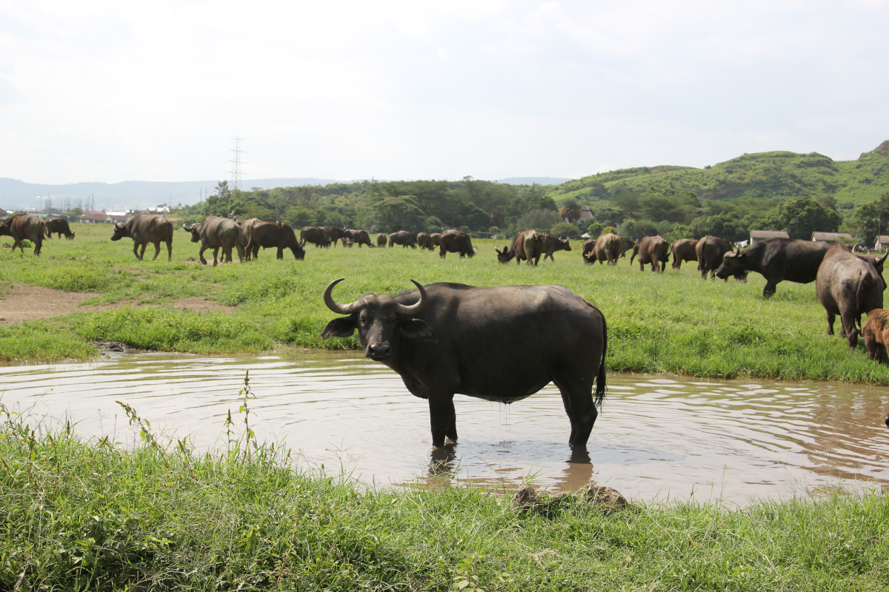

# About

I'm a 25-year old computer science & business student in Aalto University. I am currently working at a digital growth consultancy as a full-stack developer, and a recent project at work brought up the thought of educating myself more on DevOps. I spend quite a lot of my free time on various volunteering projects - among other things I am an accredited museum guide at the only museum in the world focusing on the cultural history of university student life. In the past few years I've also developed an interest in Africa and wildlife conservation efforts there and I've visited Kenya a handful of times.

[Diary entry](diary-095.md)

